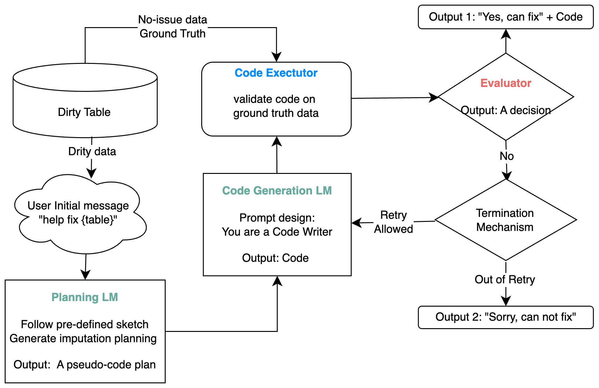

# TabFill: Sketch-Guided Missing Value Imputation on Tabular Data via Large Language Models

> Remark: Repo served as a project demonstration for Course DSAA5002, Spring Term 24 @HKUST-GZ. More comprehensive studies will be updated in future work.

## Keywords
Data Preprocessing, Large Language Models, Tabular Data, Data Imputation

## Introduction
This project is to impute missing values in tabular data using LLM. We acknowledge that data cleaning takes up a lot of time in a data science project 
and LLM can be a good solution attributed to its ability to in-contextual learning and prompt engineering. Therefore, we will explore the LLM as a tool for tabular data cleanup.
To begin with, we will focus on the missing value imputation task, which is a common issue among tables. We examined three different approach, which are prompt-free, Chain-of-Thought Prompting, and `Sketch` that integrates planning and coding via LLMs, on solving imputation tasks.

The experiments ran on two domain datasets: flight + supermarkets. For each dataset, there are some missing values on certain column fields. LLM tends to extract the potential relationship that connects the missing field with other known field values to derive the final answer. In conclusion, the prompt-free and CoT prompting achieved good performance on the imputation task but less extendibility due to a tailor-made solution on each missing value cell. Instead, our approach harness the LLM capability of planning and coding so that we can have an executable code eventually, that is portable to maintain or scale up.

## Framework


## Repo Structure
- main.py
- chunk_table.py
- etc
  - config_template.yaml
  - config_private.yaml (for local only)
- llm
  - prompt_template.py: un, cot, sketch 
  - chat.py: chat with openai models
  - coding.py: code writer & code executor, LLM as backend
- utils (helper functions)
  - file_io.py: txt, csv, json
  - logger.py
- dataset
  - flight.csv: [Kaggle Link](https://www.kaggle.com/datasets/jillanisofttech/flight-price-prediction-dataset)
  - supermarket.csv:  [Kaggle Link](https://www.kaggle.com/datasets/lovishbansal123/sales-of-a-supermarket)
- demo: collections of experiment with each sub-directory as an experiment
  - slice-data: raw data
  - dirty-data: the noise added data as the input
  - code: code agent chat history (only for `prompt_type=sketch`)
  - chat: the prompt-based fixing plan for solving the problem
  - log: the log of the experiment by prompt
  - report: the report indicates where the missing values are located and the imputation result
- requirements.txt

## CLI Command
Mimic noisy data, preprocess raw tabular data to mimic the missing value problem
- `exp-dir` is to store all tests with related file I/Os on sketch, agent result and imputation evaluation
- `dataset` is downloaded from Kaggle for demonstration purposes.
- `columns` indicates the column fields where the missing values are took from the raw data.

```shell
# for flight data
python chunk_table.py \
--dataset dataset/flight.csv \
--columns "Source,Total_Stops" \
--exp-dir demo/flight \
--num-slices 10 \
--num-rows 7

# for supermarket data
python chunk_table.py \
--dataset dataset/supermarket.csv \
--columns "Tax 5%,Total" \
--exp-dir demo/supermarket \
--num-slices 10 \
--num-rows 5
```

Run imputation pipeline on experiment directory
`prompt-type` decides the prompting strategy. currently support `un`(prompt-free), `cot`, and `sketch`. 
```shell
# for flight data
python main.py \
--config etc/config_private.yaml \
--prompt-type sketch \
--exp-dir demo/flight

# for supermarket data
--config etc/config_private.yaml \
--prompt-type un \
--exp-dir demo/supermarket
```

## Note
The `etc/config_private.yaml` is for local use only. You should configure some fields like `openai_config`. After the experiment is done, 
You can find report and log files in the `demo/{dataset}` directory. Make a copy before running the next experiment if using the same data slices.
Default setting will override the previous experiment output.

## Related Resources
- [OpenAI](https://platform.openai.com/) for backend serving LLM.
- [LangChain-Model I/O](https://python.langchain.com/docs/modules/model_io/) by LangChain. It is a powerful framework for LLM-based applications.
- [AutoGen](https://github.com/microsoft/autogen) by Microsoft. It is a programming framework for agentic AI. We use it to convert sketch to code and execute it.
